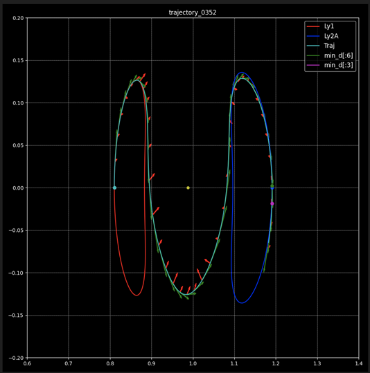

Our project is based on a paper by Lorenzo Federici et al. (link below). This paper introduces the concept of using a Proximal Policy Optimization (PPO) reinforcement learning model to learn the optimal orbital transfer trajectory between the Lyapunov 1 and 2 orbits. Drawing on this paper, my mentor develops the majority of the framework for this project.

In this project, my responsibility is to enhance the model by integrating Hyperparameter Optimization. Specifically, I use Optuna for Bayesian Optimization, an approach for selecting the best hyperparameters. Bayesian Optimization in Optuna models the function using probability and iteratively updates this model as more data becomes available. This method effectively balances exploration (trying new hyperparameters) and exploitation (using hyperparameters known to perform well).

Additionally, I implement Hyperband Pruning with Optuna. Hyperband is a bandit-based approach to hyperparameter optimization that quickly identifies promising hyperparameter sets and allocates more resources to their evaluation. At the same time, it prunes or stops the evaluation of less promising ones early in the process. This technique is beneficial as it speeds up the optimization process, ensuring that computational resources are efficiently used by focusing on more promising model configurations.

Through the application of Optuna's Bayesian Optimization combined with Hyperband Pruning, we enhance the model's learning efficacy and decrease overall run times, leading to a more efficient and effective learning process.

Here is a link to the paper written my Lorenzo Federici et al.: [Autonomous Guidance For Cislunar Orbit Transfers Via Reinforcement Learning](https://www.researchgate.net/publication/353828924_Autonomous_Guidance_for_Cislunar_Orbit_Transfers_via_Reinforcement_Learning).
