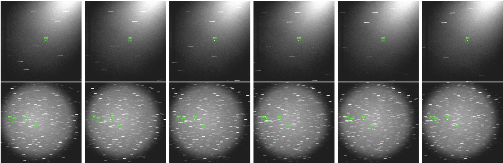

  

The project goal was to implement a state of the art process known as MultiSWAG to an object detection algorithm. This implementation would provide a truer prediction by estimating the uncertainties using MultiSWAG. MultiSWAG is a Bayesian deep learning model that learns a probability distribution distribution of its weights. This probability distribution of parameters returns an expectation and a variance which is then propagated through the Neural Network to give us a Gaussian distribution of the weights. This process is done multiple times and ensembled (hence Multi). 

I was tasked with modifying the satellite dataset, which is compatible with tensorboard, to work in our MultiSWAG model which is written in PyTorch. Then to demonstrate the improvements, I tested the dataset in an object detection model called YOLOv3 as a baseline to compare to the MultiSWAG model. 
Unfortunately, we were unable to complete the MultiSWAG model but the method still shows promise for potential future work. If given the opportunity, I would like to continue the research and work on the applications of MultiSWAG to our satellite detection model. 

Here is a link to the paper that was written on MultiSWAG and Bayesian Deep Learning: [Bayesian Deep Learning and a Probabilistic Perspective of Generalization](https://arxiv.org/abs/2002.08791).
