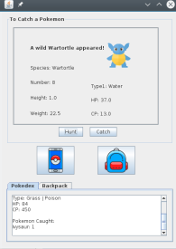

  

The project's goal was to create a Graphical User Interface (GUI) for a simplified version of Pokémon. The GUI featured two main sections: one displaying the Pokémon available for capture, and another listing the Pokémon that had been caught. My primary responsibility was to design the GUI layout using Panels, as illustrated in the image above. To accomplish this, I developed a PokemonPanel class that assembled all the panels, text windows, and scrolling windows for the GUI.

My second task involved creating a listener to respond to user actions. For this, I implemented a GUIListener class, which ensured the appropriate response was triggered based on the user's selections on the screen. Meanwhile, my group members focused on implementing the functionality for listing captured Pokémon and managing the capture process.

Additionally, we had previously developed each Pokémon in our game as an object within a Pokemon class, with each Pokémon featuring an interface corresponding to its type. Our group also introduced a feature for a pop-up menu, enabling users to sort the list of Pokémon based on various criteria.